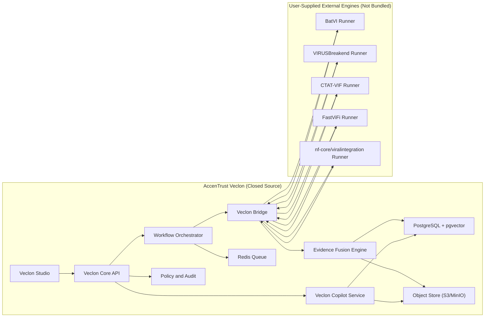

# Veclon Architecture (Closed-source-friendly)

## Licensing boundary

- Veclon core does not include third-party GPL code.
- External engines are user-provided and invoked via bridge adapters.
- Canonical output is generated by Veclon-owned schemas and fusion logic.
